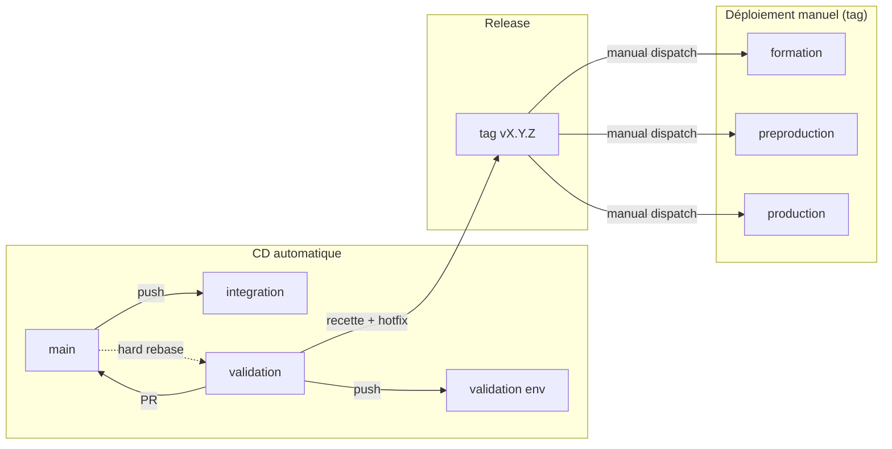
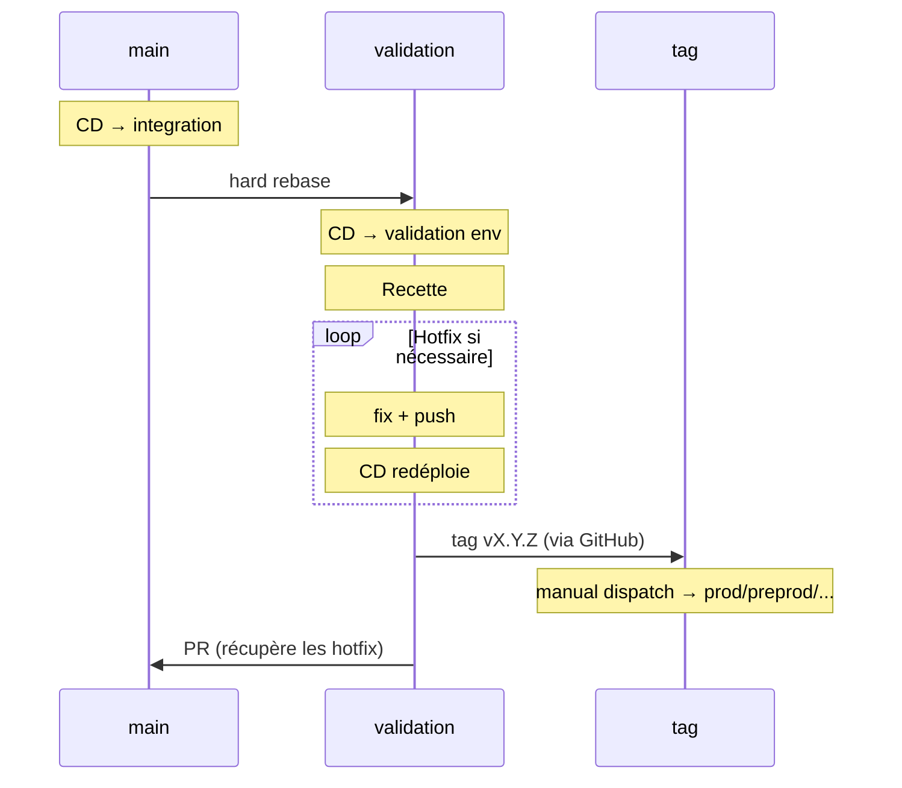
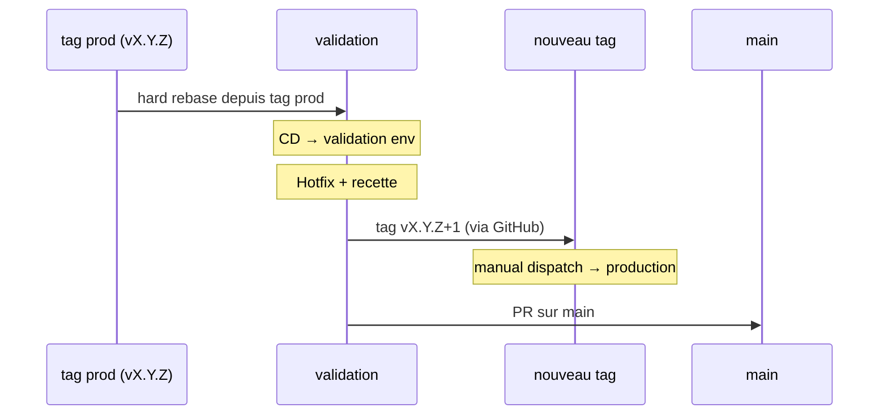
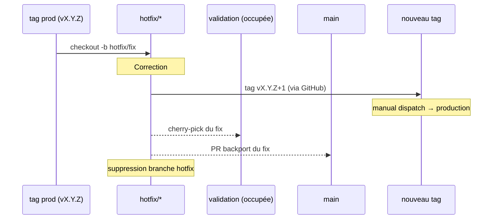

# Processus de Release - Sirena

## Vue d'ensemble



### Release standard



### Hotfix production



### Hotfix prod urgent (validation occupée)



## Déploiement continu (CD)

| Branche / Ref  | Environnement(s)                                    | Déclenchement    |
|-----------------|------------------------------------------------------|------------------|
| `main`          | integration                                          | Automatique      |
| `validation`    | validation                                           | Automatique      |
| Tag `vX.Y.Z`    | formation, preproduction, production                 | Manual dispatch  |

## Release standard

### 1. Préparer la branche validation

```bash
git checkout validation
git fetch origin
git reset --hard origin/main
git push --force-with-lease origin validation
```

> Le CD déploie automatiquement sur l'environnement **validation**.

### 2. Recette sur validation

L'équipe teste sur l'environnement validation. Si un bug est trouvé, corriger directement sur `validation` :

```bash
git checkout validation
git pull origin validation
# ... fix ...
git commit -m "fix: correction du bug X"
git push origin validation
```

Le CD redéploie automatiquement sur validation.

### 3. Créer le tag

Une fois la recette validée, le PO crée le tag via l'interface GitHub :

1. Aller dans **Releases** → **Draft a new release**
2. Créer un nouveau tag (ex: `v1.4.0`) pointant sur la branche `validation`
3. Publier la release

### 4. Déployer le tag

Lancer le workflow de déploiement via GitHub Actions (manual dispatch) en sélectionnant le tag `v1.4.0` et le ou les environnements cibles.

### 5. Merger validation sur main

Pour récupérer les éventuels hotfix de recette, créer une PR GitHub :

```bash
gh pr create --base main --head validation --title "release: merge validation v1.4.0 into main"
```

Merger la PR après review.

## Hotfix en production

### 1. Préparer validation depuis le tag de production

```bash
# Identifier le tag actuellement en production
git tag --list 'v*' --sort=-v:refname | head -1

git checkout validation
git fetch origin
git reset --hard v1.4.0   # tag de production
git push --force-with-lease origin validation
```

### 2. Appliquer le correctif

```bash
git checkout validation
# ... fix ...
git commit -m "fix: correction critique en production"
git push origin validation
```

Tester sur l'environnement validation (CD automatique).

### 3. Taguer et déployer

Le PO crée le tag via l'interface GitHub :

1. Aller dans **Releases** → **Draft a new release**
2. Créer un nouveau tag (ex: `v1.4.1`) pointant sur la branche `validation`
3. Publier la release

Déployer le tag en production via manual dispatch.

### 4. Reporter sur main

Créer une PR GitHub :

```bash
gh pr create --base main --head validation --title "fix: merge hotfix v1.4.1 into main"
```

Merger la PR après review.

## Cas particuliers

### Hotfix prod urgent alors que validation est occupée par une release

La branche `validation` est en cours de recette et ne peut pas être écrasée. Utiliser une branche `hotfix/*` temporaire :

```bash
# Créer la branche hotfix depuis le tag de production
git checkout -b hotfix/critical-fix v1.4.0
# ... fix ...
git commit -m "fix: correction critique urgente"
git push origin hotfix/critical-fix

```

Le PO crée le tag `v1.4.1` via l'interface GitHub, pointant sur la branche `hotfix/critical-fix`. Déployer le tag en production via manual dispatch.

Une fois le hotfix déployé, reporter le fix via des PRs :

```bash
# Cherry-pick sur validation (en cours de recette)
git checkout validation
git cherry-pick <sha-du-fix>
git push origin validation

# Cherry-pick sur main via une branche temporaire + PR
git checkout -b backport/critical-fix origin/main
git cherry-pick <sha-du-fix>
git push origin backport/critical-fix
gh pr create --base main --head backport/critical-fix --title "fix: backport hotfix v1.4.1"
```

Après merge des PRs, supprimer les branches :

```bash
git push origin --delete hotfix/critical-fix backport/critical-fix
```

### Rollback rapide en production

**Option 1 : Redéployer le tag précédent** (recommandé)

Lancer le workflow de manual dispatch avec le tag précédent (ex: `v1.3.0`). Aucune manipulation git nécessaire.

**Option 2 : Via ArgoCD**

Dans l'interface ArgoCD, revenir à la révision précédente du déploiement (History & Rollback).

Dans les deux cas, cela ne constitue qu'une mesure temporaire. Un hotfix doit suivre pour corriger le problème.

### Hotfix qui concerne aussi la prochaine release

Si le fix appliqué en production doit aussi être présent dans la release en cours sur `validation` :

```bash
# Reporter le fix sur validation (push direct, branche de recette)
git checkout validation
git cherry-pick <sha-du-fix>
git push origin validation

# Reporter sur main via PR
git checkout -b backport/fix-xyz origin/main
git cherry-pick <sha-du-fix>
git push origin backport/fix-xyz
gh pr create --base main --head backport/fix-xyz --title "fix: backport du fix XYZ"
```

Le `cherry-pick` garantit que le fix est présent dans les trois branches sans attendre le merge final.

### Conflit lors du merge de validation sur main

Si la PR `validation → main` présente des conflits :

```bash
git checkout main
git pull origin main
git merge origin/validation
# Résoudre les conflits manuellement
git add .
git commit
git push origin main
```

Règle : en cas de doute sur la résolution, privilégier le code de `validation` puisqu'il a été validé en recette. Si `main` a avancé avec des fonctionnalités non incluses dans la release, s'assurer qu'elles ne sont pas écrasées.

### Tags qui pointent sur des commits différents de main

Après plusieurs hotfix de recette, `validation` contient des commits absents de `main`. C'est normal et attendu. Le merge final (étape 5 de la release standard) réconcilie les deux branches.

Ne jamais rebaser `main` sur `validation`. Toujours merger `validation` dans `main`.

### Deux releases en parallèle

Ce processus ne supporte qu'une seule release à la fois sur `validation`. Si un besoin de release parallèle se présente, traiter séquentiellement : terminer ou abandonner la release en cours avant d'en démarrer une autre.
