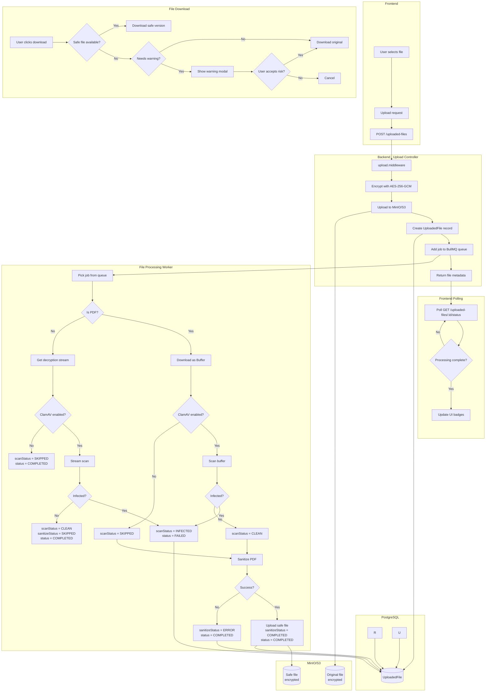

# File Upload Flow



## Flow Summary

1. **Upload**: File is encrypted (AES-256-GCM) before storage in MinIO/S3
2. **Queue**: Job is added to BullMQ for async processing
3. **Scan**: Worker downloads, decrypts, and scans with ClamAV (if enabled)
4. **Sanitize**: PDFs are sanitized to remove JavaScript, embedded files, and dangerous actions
5. **Poll**: Frontend polls status endpoint until processing completes
6. **Download**: Safe version served when available; warnings shown for incomplete/failed processing

## Status Values

### scanStatus
- `PENDING` - Waiting for scan
- `SCANNING` - Scan in progress
- `CLEAN` - No threats detected
- `INFECTED` - Threat detected
- `ERROR` - Scan failed
- `SKIPPED` - ClamAV not configured

### sanitizeStatus
- `PENDING` - Waiting for sanitization
- `SANITIZING` - Sanitization in progress
- `COMPLETED` - Safe file available
- `ERROR` - Sanitization failed
- `SKIPPED` - Not a PDF file

## Memory and Streaming Architecture

### Current Implementation

The implementation uses **streaming** where possible to minimize memory usage:

| Stage | Component | Strategy | Memory Impact |
|-------|-----------|----------|---------------|
| **Upload** | `upload.middleware.ts` | Buffer (multipart parsing) | File size |
| **Encryption** | `minio.ts` | Stream (`createEncryptionStream`) | Minimal |
| **Storage** | MinIO/S3 | Buffer (content-length required) | File size |
| **Non-PDF Scan** | `clamav.ts` | Stream (`scanStream`) | Minimal |
| **PDF Scan** | `clamav.ts` | Buffer (`scanBuffer`) | File size |
| **PDF Sanitization** | `pdfSanitizer.ts` | Buffer (pdf-lib limitation) | 2-3x file size |

### Processing Paths

```
Non-PDF files:  Stream → Decrypt → Stream to ClamAV → Done
PDF files:      Stream → Decrypt → Buffer → Scan → Sanitize → Re-encrypt → Upload
```

### Identified Risks

| Risk | Impact | Probability | Current Mitigation |
|------|--------|-------------|-------------------|
| **Memory exhaustion** | Worker crash | Low (non-PDF), Medium (PDF) | Streaming for non-PDF, size limits |
| **Denial of service** | Service unavailability | Low | Limited concurrency (2 workers) |
| **High latency** | Degraded UX | Medium | Asynchronous processing |
| **Large PDFs** | Timeout/failure | Medium | Retry with exponential backoff |

### Recommended Limits

```
Max file size: 50 MB (configurable)
Worker concurrency: 2 simultaneous jobs
Scan timeout: 60 seconds
Worker memory: plan for ~3x max PDF size
```

### Memory Footprint Examples

**Non-PDF file (20 MB)**:
- Streaming scan: ~8 KB chunks
- **Total**: Minimal (~100 KB)

**PDF file (20 MB)**:
- Decrypted buffer: ~20 MB
- pdf-lib internal: ~40-60 MB
- Sanitized buffer: ~20 MB
- **Total potential**: ~100-120 MB per PDF being processed
