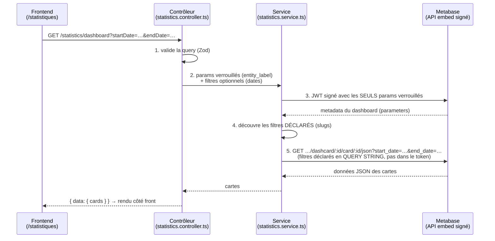

# Filtres du dashboard statistiques Metabase

Ce document explique comment fonctionnent les filtres appliqués au dashboard Metabase
exposé sur la page **Indicateurs** (`/statistiques`), comment en **définir de nouveaux**
côté Metabase, et comment **adapter les requêtes SQL** des cartes pour qu'elles en tiennent
compte.

Le premier filtre implémenté est un **filtre de période** (date de début / date de fin).

---

## 1. Vue d'ensemble du flux

Sirena n'affiche pas d'iframe Metabase : le backend récupère les données de chaque carte via
l'**API d'embedding signé** de Metabase, puis le frontend les rend avec ses propres composants
(KPI, tableaux, graphiques).



> **Token vs query string (point crucial).** En embedding signé Metabase, les paramètres
> **« Locked »** sont lus dans le **JWT** (`params`), tandis que les paramètres **« Enabled »**
> sont lus dans la **query string** de la requête d'embedding — **jamais** dans le token. Mettre
> une borne de date « Enabled » dans le JWT est donc **silencieusement ignoré** par Metabase
> (symptôme classique : « le filtre marche dans Metabase mais pas dans l'app »). Le service met
> donc `entity_label` (Locked) dans le token et `start_date` / `end_date` (Enabled) en query
> string.

> **Découverte dynamique des filtres.** Le backend ne code pas en dur les filtres qu'il
> envoie : il lit le tableau `parameters` renvoyé par l'API d'embedding du dashboard
> (`extractDashboardParameterSlugs`) et ne passe en query string que les filtres optionnels que
> le dashboard déclare réellement. Un filtre fourni mais non déclaré est **ignoré** au lieu de
> provoquer une erreur Metabase « paramètre inconnu ». Ajouter un filtre côté Metabase suffit
> donc à l'activer, sans redéploiement du backend.

Les **`params`** signés dans le JWT alimentent les **paramètres** du dashboard Metabase, qui
sont eux-mêmes câblés sur les **template tags** (`{{...}}`) des requêtes SQL des cartes.

---

## 2. Le filtre de période (date)

### Correspondance API ↔ Metabase

Le contrôleur traduit la query en paramètres Metabase. **Les bornes ne sont transmises (en
query string) que si elles sont fournies _et_ déclarées par le dashboard** (découverte
dynamique ci-dessus) : un dashboard sans filtre de date configuré continue donc de fonctionner
exactement comme avant (cf. § sécurité).

| Query param (API) | Paramètre Metabase | Visibilité embedding | Transmis via |
| --- | --- | --- | --- |
| `startDate` | `start_date` | **Enabled** (optionnel) | query string |
| `endDate` | `end_date` | **Enabled** (optionnel) | query string |
| _(périmètre entité)_ | `entity_label` | **Locked** (imposé serveur) | JWT (token) |

> ⚠️ La visibilité **doit** être cohérente avec le mode de transmission : un paramètre
> **« Enabled »** se passe en **query string** (ce que fait le service) ; un paramètre
> **« Locked »** se passe dans le **token**. Si `start_date` / `end_date` étaient réglés sur
> « Locked » côté Metabase, la query string serait refusée — garder ces filtres en **Enabled**.

### État dans l'URL

Côté front, le filtre est persisté dans l'URL (`?startDate=…&endDate=…`) via `validateSearch`
de TanStack Router. La période est donc **partageable** et **conservée au rechargement**, et
chaque changement relance automatiquement la requête (la `queryKey` inclut les bornes).

---

## 3. Configurer le filtre côté Metabase

Tant que le dashboard Metabase n'expose pas les paramètres `start_date` / `end_date`, le
backend continue de fonctionner mais les bornes envoyées sont ignorées. Pour activer le filtre
de bout en bout :

### 3.1. Ajouter les template tags dans chaque requête de carte

Dans l'éditeur SQL de la carte, référencer les variables — voir § 4 pour le SQL exact. Metabase
crée alors automatiquement deux **template tags** ; les configurer ainsi :

| Template tag | Type | Obligatoire |
| --- | --- | --- |
| `start_date` | **Date** | non |
| `end_date` | **Date** | non |

> Type **Date** (et non « Field Filter ») : on pilote nous-mêmes deux bornes simples, ce qui
> donne une valeur de token triviale au format `YYYY-MM-DD`.

### 3.2. Créer les paramètres au niveau du dashboard

Sur le dashboard, ajouter deux filtres de type **Date → Date unique** :

- un filtre « Date de début » de slug **`start_date`** ;
- un filtre « Date de fin » de slug **`end_date`**.

Puis **mapper** chaque filtre du dashboard sur le template tag correspondant de **chaque
carte** concernée (Metabase : cliquer sur le filtre → sélectionner la variable de la carte).
Le `slug` du paramètre doit être identique au nom envoyé par le backend (`start_date`,
`end_date`).

### 3.3. Régler la visibilité d'embedding

Dans **Partager → Embedding → Paramètres** :

- `entity_label` → **Locked** (sécurité : imposé par le serveur, l'utilisateur ne peut pas
  élargir son périmètre) ;
- `start_date` → **Enabled** ;
- `end_date` → **Enabled**.

> « Enabled » rend le paramètre **optionnel** : quand le backend ne le signe pas (aucune date
> choisie), Metabase n'applique aucun filtre. « Locked » exigerait au contraire une valeur à
> chaque appel.

### 3.4. Re-synchroniser la sauvegarde

Une fois le dashboard configuré, mettre à jour le snapshot versionné :

```bash
pnpm op:metabase:export-dashboard 4
```

Le diff doit faire apparaître les nouveaux `template-tags`, les `parameters` du dashboard et
les entrées `start_date` / `end_date` dans `embedding_params`.

---

## 4. Adapter les requêtes SQL des cartes

### Principe

On ajoute des **clauses optionnelles** `[[ ... ]]` : si la variable n'a pas de valeur, Metabase
retire entièrement la clause. On filtre sur la **colonne de date métier** de la carte —
typiquement la date de réception de la requête `Requete."receptionDate"` (ou `"createdAt"`
selon le besoin).

```sql
-- Pattern générique : <colonne_date> est la date sur laquelle porte la statistique
[[ AND <colonne_date> >= {{start_date}} ]]
[[ AND <colonne_date> <= {{end_date}} ]]
```

Points d'attention :

- chaque borne est dans son **propre** bloc `[[ ]]` pour rester indépendamment optionnelle ;
- `{{start_date}}`/`{{end_date}}` doivent apparaître dans une clause `WHERE` (ou `AND`) déjà
  amorcée, sinon préfixer le premier bloc par `[[ WHERE ... ]]` ;
- une carte sans dimension temporelle pertinente n'a simplement pas besoin de ces clauses (ne
  pas mapper les paramètres du dashboard dessus).

### Exemple 1 — Carte 45 (« Combien de requêtes de l'ARS NOR ? »)

La requête actuelle ne joint pas `Requete`. On ajoute la jointure pour accéder à la date, puis
les clauses optionnelles :

```sql
SELECT
  COUNT(*) AS nombre_requetes
FROM
  "RequeteEntite" re
  JOIN "Entite" e ON e.id = re."entiteId"
  JOIN "Requete" r ON r.id = re."requeteId"
WHERE
  e.label = {{entity_label}}
  [[ AND r."receptionDate" >= {{start_date}} ]]
  [[ AND r."receptionDate" <= {{end_date}} ]];
```

### Exemple 2 — Carte 47 (« Répartition par raison de clôture »)

`RequeteEntite re` est déjà relié à `RequeteEtape et`. La clôture étant un événement daté, on
filtre ici sur la date de l'étape de clôture `et."createdAt"` (adapter selon la sémantique
voulue) :

```sql
SELECT
  cr.label              AS raison_cloture,
  COUNT(DISTINCT et.id) AS nb_requetes
FROM "RequeteEntite" re
JOIN "Entite" e
  ON e.id = re."entiteId"
JOIN "RequeteEtape" et
  ON et."requeteId" = re."requeteId"
 AND et."entiteId"  = re."entiteId"
 AND et."statutId"  = 'CLOTUREE'
JOIN "_RequeteClotureReasonEnumToRequeteEtape" j
  ON j."B" = et.id
JOIN "RequeteClotureReasonEnum" cr
  ON cr.id = j."A"
WHERE re."statutId" = 'CLOTUREE'
  -- AND e.label = {{entity_label}}
  [[ AND et."createdAt" >= {{start_date}} ]]
  [[ AND et."createdAt" <= {{end_date}} ]]
GROUP BY cr.label
ORDER BY nb_requetes DESC;
```

> `end_date` est **inclusive** : si la colonne est un `timestamp` (heure comprise), une borne
> de fin `2026-03-31` exclut les événements du 31 après 00:00. Pour inclure toute la journée,
> filtrer plutôt sur `< end_date + interval '1 day'`, ou borner sur la date seule
> (`<colonne>::date <= {{end_date}}`).

---

## 5. Ajouter un nouveau filtre

Le filtre de période sert de modèle. Pour un nouveau filtre (ex. un statut), répéter les mêmes
couches :

1. **Schéma backend** (`statistics.schema.ts`) — ajouter le champ à
   `StatisticsDashboardQuerySchema` avec sa validation Zod.
2. **Contrôleur** (`statistics.controller.ts`) — lire la valeur validée et l'ajouter à l'objet
   des **filtres optionnels** (2ᵉ argument de `fetchDashboardCardsData`), en utilisant comme clé
   le **slug exact** du paramètre Metabase. Le service se charge de ne le signer que s'il est
   fourni et déclaré par le dashboard — rien d'autre à coder côté service.
3. **Front** — propager la valeur dans `fetchStatistics.ts` (query string), `statistics.hook.ts`
   (`queryKey`) et l'UI dans `statistiques.tsx` (idéalement piloté par l'URL).
4. **Metabase** — créer le(s) template tag(s), le paramètre de dashboard (même `slug` que le nom
   envoyé), le mapper sur les cartes, le passer en **Enabled**, puis re-exporter.
5. **SQL** — ajouter la clause optionnelle `[[ ... {{mon_param}} ... ]]` aux cartes concernées.

---

## 6. Sécurité & points d'attention

- **`entity_label` doit rester `Locked`.** C'est lui qui restreint les statistiques au
  périmètre de l'entité de l'utilisateur ; il est imposé côté serveur et ne doit jamais être
  pilotable par le client.
- **Les filtres « confort » (date, etc.) sont `Enabled`.** Ils ne changent pas le périmètre de
  sécurité, seulement le sous-ensemble temporel affiché. Le backend les signe lui-même après
  validation Zod ; aucune valeur brute du client n'atteint Metabase sans passer par cette
  validation.
- **Dégradation gracieuse.** Le backend découvre les filtres déclarés par le dashboard et ne
  transmet `start_date` / `end_date` (en query string) que s'ils sont fournis **et** déclarés.
  Sélectionner une date sur un dashboard qui n'expose pas encore ces paramètres est donc sans
  effet (filtre ignoré), et non plus une erreur Metabase. Activer le filtre côté Metabase (§ 3)
  suffit à le rendre opérant, sans changement de code.
- **Token vs query string.** En embedding signé, un paramètre **« Enabled »** ne se lit que
  dans la **query string**, jamais dans le JWT. Mettre une borne « Enabled » dans le token est
  silencieusement ignoré (le filtre semble marcher dans Metabase mais pas dans l'app). Le
  service passe donc les filtres optionnels en query string et réserve le token au seul
  `entity_label` verrouillé.
