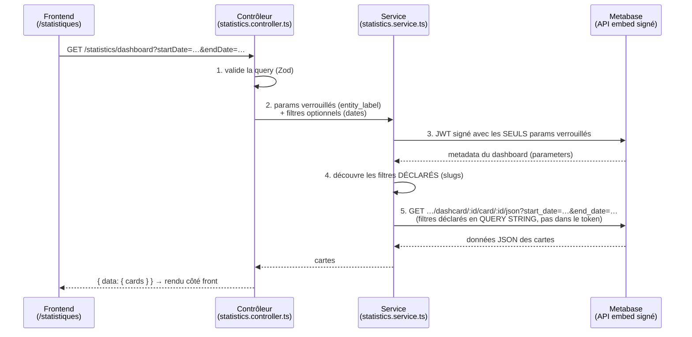

# Filtres du dashboard statistiques Metabase

Ce document explique comment fonctionnent les filtres appliqués au dashboard Metabase
exposé sur la page **Indicateurs** (`/statistiques`), comment en **définir de nouveaux**
côté Metabase, et comment **adapter les requêtes SQL** des cartes pour qu'elles en tiennent
compte.

Trois filtres sont implémentés, **cumulables** entre eux : un **filtre de période** (date de
début / date de fin), un **filtre de domaine fonctionnel** (multi-sélection) et une **exclusion
des requêtes EIG** (case à cocher, active par défaut).

---

## 1. Vue d'ensemble du flux

Sirena n'affiche pas d'iframe Metabase : le backend récupère les données de chaque carte via
l'**API d'embedding signé** de Metabase, puis le frontend les rend avec ses propres composants
(KPI, tableaux, graphiques).


```mermaid
sequenceDiagram
    participant F as Frontend<br/>(/statistiques)
    participant C as Contrôleur<br/>(statistics.controller.ts)
    participant S as Service<br/>(statistics.service.ts)
    participant M as Metabase<br/>(API embed signé)

    F->>C: GET /statistics/dashboard?startDate=…&endDate=…
    C->>C: 1. valide la query (Zod)
    C->>S: 2. params verrouillés (entity_label)<br/>+ filtres optionnels (dates)
    S->>M: 3. JWT signé avec les SEULS params verrouillés
    M-->>S: metadata du dashboard (parameters)
    S->>S: 4. découvre les filtres DÉCLARÉS (slugs)
    S->>M: 5. GET …/dashcard/:id/card/:id/json?start_date=…&end_date=…<br/>(filtres déclarés en QUERY STRING, pas dans le token)
    M-->>S: données JSON des cartes
    S-->>C: cartes
    C-->>F: { data: { cards } } → rendu côté front
```

> **Token vs query string (point crucial).** En embedding signé Metabase, les paramètres
> **« Locked »** sont lus dans le **JWT** (`params`), tandis que les paramètres **« Enabled »**
> sont lus dans la **query string** de la requête d'embedding — **jamais** dans le token. Mettre
> un filtre de date « Enabled » dans le JWT est donc **ignoré sans générer d'erreur** par
> Metabase (symptôme classique : « le filtre marche dans Metabase mais pas dans l'app »). Le
> service met donc `entity_label` (Locked) dans le token et `start_date` / `end_date` (Enabled)
> en query string.

> **Découverte dynamique des filtres.** Le backend ne code pas en dur les filtres qu'il
> envoie : il lit le tableau `parameters` renvoyé par l'API d'embedding du dashboard
> (`extractDashboardParameterSlugs`) et ne passe en query string que les filtres optionnels que
> le dashboard déclare réellement. Un filtre fourni mais non déclaré est **ignoré** au lieu de
> provoquer une erreur Metabase « paramètre inconnu ». Ajouter un filtre côté Metabase suffit
> donc à l'activer, sans redéploiement du backend.

Les **`params`** signés dans le JWT alimentent les **paramètres** du dashboard Metabase, qui
sont eux-mêmes câblés sur les **template tags** (`{{...}}`) des requêtes SQL des cartes.

---

## 2. Le filtre de période (date)

### Correspondance API ↔ Metabase

Le contrôleur traduit la query en paramètres Metabase. **Les dates de début et de fin ne sont
transmises (en query string) que si elles sont fournies _et_ déclarées par le dashboard**
(découverte dynamique ci-dessus) : un dashboard sans filtre de date configuré continue donc de
fonctionner exactement comme avant (cf. § sécurité).

| Query param (API) | Paramètre Metabase | Visibilité embedding | Transmis via |
| --- | --- | --- | --- |
| `startDate` | `start_date` | **Enabled** (optionnel) | query string |
| `endDate` | `end_date` | **Enabled** (optionnel) | query string |
| `domaineIds` | `domaine_fonctionnel` | **Enabled** (optionnel) | query string |
| `includeEIG` | `inclure_eig` | **Enabled** (optionnel) | query string |
| _(périmètre entité)_ | `entity_label` | **Locked** (imposé serveur) | JWT (token) |

> ⚠️ La visibilité **doit** être cohérente avec le mode de transmission : un paramètre
> **« Enabled »** se passe en **query string** (ce que fait le service) ; un paramètre
> **« Locked »** se passe dans le **token**. Si `start_date` / `end_date` étaient réglés sur
> « Locked » côté Metabase, la query string serait refusée — garder ces filtres en **Enabled**.

### État dans l'URL

Côté front, le filtre est stocké dans les paramètres d'URL de la page `/statistiques`
(`?period=…` pour une période prédéfinie, ou `?startDate=…&endDate=…` pour une période
personnalisée) via `validateSearch` de TanStack Router. Elle est donc **conservée lors d'un
rechargement** et **partageable** via l'URL, et chaque changement relance automatiquement la
requête (la `queryKey` inclut les dates). En revanche, elle n'est **pas** automatiquement
conservée lors d'une navigation vers une autre page de l'application puis d'un retour sur
`/statistiques`. Le filtre de domaine fonctionnel suit exactement la même mécanique
(`?domaineIds=SOCIAL,SANITAIRE`). L'option d'inclusion des EIG suit la même mécanique, avec la
nuance d'être **activée par défaut** : le paramètre n'apparaît dans l'URL que lorsque
l'utilisateur désactive l'inclusion des EIG (`?includeEIG=false`). En l'absence du paramètre,
les EIG sont inclus.

---

## 3. Configurer le filtre côté Metabase

Tant que le dashboard Metabase n'expose pas les paramètres `start_date` / `end_date`, le
backend continue de fonctionner mais les dates envoyées sont ignorées. Pour activer le filtre
de bout en bout :

### 3.1. Ajouter les template tags dans chaque requête de carte

Dans l'éditeur SQL de la carte, référencer les variables — voir § 4 pour le SQL exact. Metabase
crée alors automatiquement deux **template tags** ; les configurer ainsi :

| Template tag | Type | Obligatoire |
| --- | --- | --- |
| `start_date` | **Date** | non |
| `end_date` | **Date** | non |

> Type **Date** (et non « Field Filter ») : on pilote nous-mêmes deux dates simples, ce qui
> donne une valeur de token triviale au format `YYYY-MM-DD`.

### 3.2. Créer les paramètres au niveau du dashboard

Sur le dashboard, ajouter deux filtres de type **Date → Date unique** :

- un filtre « Date de début » de slug **`start_date`** ;
- un filtre « Date de fin » de slug **`end_date`**.

Puis **mapper** chaque filtre du dashboard sur le template tag correspondant de **chaque
carte** concernée (Metabase : cliquer sur le filtre → sélectionner la variable de la carte).
Le `slug` du paramètre doit être identique au nom envoyé par le backend (`start_date`,
`end_date`).

### 3.3. Régler la visibilité d'embedding

Dans **Partager → Embedding → Paramètres** :

- `entity_label` → **Locked** (sécurité : imposé par le serveur, l'utilisateur ne peut pas
  élargir son périmètre) ;
- `start_date` → **Enabled** ;
- `end_date` → **Enabled**.

> « Enabled » rend le paramètre **optionnel** : quand le backend ne le signe pas (aucune date
> choisie), Metabase n'applique aucun filtre. « Locked » exigerait au contraire une valeur à
> chaque appel.

### 3.4. Re-synchroniser la sauvegarde

Une fois le dashboard configuré, mettre à jour le snapshot versionné :

```bash
pnpm op:metabase:export-dashboard 4
```

Le diff doit faire apparaître les nouveaux `template-tags`, les `parameters` du dashboard et
les entrées `start_date` / `end_date` dans `embedding_params`.

---

## 4. Adapter les requêtes SQL des cartes

### Principe

On ajoute des **clauses optionnelles** `[[ ... ]]` : si la variable n'a pas de valeur, Metabase
retire entièrement la clause. On filtre sur la **colonne de date métier** de la carte —
typiquement la date de réception de la requête `Requete."receptionDate"` (ou `"createdAt"`
selon le besoin).

```sql
-- Pattern générique : <colonne_date> est la date sur laquelle porte la statistique
[[ AND <colonne_date> >= {{start_date}} ]]
[[ AND <colonne_date> <= {{end_date}} ]]
```

Points d'attention :

- chaque date est dans son **propre** bloc `[[ ]]` pour rester indépendamment optionnelle ;
- `{{start_date}}`/`{{end_date}}` doivent apparaître dans une clause `WHERE` (ou `AND`) déjà
  amorcée, sinon préfixer le premier bloc par `[[ WHERE ... ]]` ;
- une carte sans dimension temporelle pertinente n'a simplement pas besoin de ces clauses (ne
  pas mapper les paramètres du dashboard dessus) ;
- filtrer sur la **même colonne de date que les cartes KPI** (`r."createdAt"`) quand le
  pourcentage d'une carte a pour dénominateur un effectif affiché ailleurs sur la page, sinon
  les deux chiffres ne portent pas sur le même ensemble. Attention aux colonnes **nullables**
  (`Requete."receptionDate"` l'est) : filtrer dessus écarte silencieusement les lignes à `NULL`.

Deux pièges hors filtres, mais qui se paient sur ces mêmes cartes :

- **regrouper sur un identifiant, jamais sur un libellé.** `MotifEnum.label` n'est pas unique :
  8 motifs différents s'appellent « Autres » (un par catégorie parente, l'id étant de la forme
  `PARENT/ENFANT`). Un `GROUP BY label` fusionne donc des motifs sans rapport. Les libellés des
  catégories parentes ne sont pas en base : ils vivent dans
  `packages/common/src/constants/motifs.constant.ts`.
- **dimension multivaluée** (plusieurs motifs ou plusieurs motifs de clôture par requête) :
  dédoublonner par requête et calculer la part en SQL — cf. l'exemple 2 ci-dessous.

### Exemple 1 — Carte 45 (« Combien de requêtes de l'ARS NOR ? »)

La requête actuelle ne joint pas `Requete`. On ajoute la jointure pour accéder à la date, puis
les clauses optionnelles :

```sql
SELECT
  COUNT(*) AS nombre_requetes
FROM
  "RequeteEntite" re
  JOIN "Entite" e ON e.id = re."entiteId"
  JOIN "Requete" r ON r.id = re."requeteId"
WHERE
  e.label = {{entity_label}}
  [[ AND r."receptionDate" >= {{start_date}} ]]
  [[ AND r."receptionDate" <= {{end_date}} ]];
```

### Exemple 2 — Carte 47 (« Répartition des requêtes clôturées par motif de clôture »)

Ici les clauses optionnelles portent sur `r."createdAt"`, comme les cartes KPI (45, 48, 49, 50,
51), pour que le dénominateur du pourcentage corresponde exactement au KPI « requêtes
clôturées » affiché sur la même page.

> ⚠️ **Dimension multivaluée.** Une requête peut être clôturée avec **plusieurs motifs**. Le
> pourcentage ne peut donc pas être déduit du total des lignes (ce que ferait le front à défaut
> de colonne de part) : il se calcule en SQL sur le **nombre de requêtes clôturées**, et la
> somme des parts dépasse alors 100 %. Il faut aussi dédoublonner par **requête** (`DISTINCT
> requete_id`) et non par étape : une requête peut porter plusieurs étapes de clôture.

```sql
WITH requetes_cloturees AS (
  SELECT DISTINCT re."requeteId" AS requete_id, re."entiteId" AS entite_id
  FROM "RequeteEntite" re
  JOIN "Entite"  e ON e.id = re."entiteId"
  JOIN "Requete" r ON r.id = re."requeteId"
  WHERE re."statutId" = 'CLOTUREE'
    AND e.label = {{entity_label}}
    [[ AND r."createdAt" >= {{start_date}} ]]
    [[ AND r."createdAt" <  ({{end_date}}::date + INTERVAL '1 day') ]]
),
total AS (
  SELECT COUNT(*) AS nb_total FROM requetes_cloturees
),
requete_motif AS (
  -- 1 ligne par (requête, motif) : dédoublonne les étapes de clôture multiples
  SELECT DISTINCT rc.requete_id, cr.label AS motif
  FROM requetes_cloturees rc
  JOIN "RequeteEtape" et
    ON et."requeteId" = rc.requete_id
   AND et."entiteId"  = rc.entite_id
   AND et."statutId"  = 'CLOTUREE'
  JOIN "_RequeteClotureReasonEnumToRequeteEtape" j ON j."B" = et.id
  JOIN "RequeteClotureReasonEnum" cr               ON cr.id = j."A"
),
par_motif AS (
  SELECT motif, COUNT(*) AS nb_requetes
  FROM requete_motif
  GROUP BY motif
)
SELECT
  pm.motif                                                 AS "Motif de clôture",
  pm.nb_requetes                                           AS "Nombre de requêtes clôturées",
  ROUND(100.0 * pm.nb_requetes / NULLIF(t.nb_total, 0), 1) AS "Part des requêtes clôturées (%)"
FROM par_motif pm
CROSS JOIN total t
WHERE pm.nb_requetes > 0
ORDER BY pm.nb_requetes DESC;
```

> Les **alias de colonnes sont les en-têtes du tableau** affiché sur `/statistiques` : les
> nommer explicitement est le seul moyen de lever l'ambiguïté du pourcentage. Le front
> reconnaît la colonne de part à son `%` (ou au type sémantique `type/Percentage`) et l'affiche
> telle quelle, sans recalcul.

> `end_date` est **inclusive** : si la colonne est un `timestamp` (heure comprise), une date
> de fin `2026-03-31` exclut les événements du 31 après 00:00. Pour inclure toute la journée,
> filtrer plutôt sur `< end_date + interval '1 day'`, ou comparer sur la date seule
> (`<colonne>::date <= {{end_date}}`).

---

## 4 bis. Le filtre de domaine fonctionnel (multi-sélection)

Le domaine fonctionnel est porté par la **situation** de la requête
(`Situation."domainesFonctionnelsId"`). Une requête peut avoir **plusieurs** situations, donc
plusieurs domaines : le filtre est un **OU** (les requêtes retenues ont *au moins un* domaine
parmi ceux cochés), et il se cumule en **ET** avec la période.

C'est le premier filtre **multivalué** du dashboard, ce qui change deux choses par rapport aux
filtres de date : la variable est réglée sur « plusieurs valeurs », et elle se transmet en
**paramètre répété** au lieu d'une valeur unique.

### Une variable multivaluée, à utiliser dans un `IN (…)`

Une variable de base Metabase peut accepter plusieurs valeurs (réglage « les utilisateurs
peuvent choisir → plusieurs valeurs »). Elle s'expanse alors en **liste de littéraux** —
`'SOCIAL', 'SANITAIRE'` — et non en valeur unique : le tag **doit** donc être entouré d'un
`IN (…)`.

```sql
AND s_df."domainesFonctionnelsId" IN ({{domaine_fonctionnel}})
```

> ⚠️ Sans les parenthèses du `IN`, la carte échoue sur `ERROR: syntax error at or near ","` dès
> qu'au moins deux valeurs sont sélectionnées : la liste est injectée là où une seule valeur est
> attendue. C'est le symptôme à reconnaître.

Ce montage garde la cible `["variable", …]` des trois filtres existants — inutile de passer par
un *Field Filter*, qui imposerait un mapping sur une colonne réelle, interdirait les alias de
table et compliquerait le SQL sans rien apporter ici.

### Transmission : un paramètre répété

Côté backend, la valeur n'est pas une chaîne CSV mais un **tableau** :
`fetchDashboardCardsData` sérialise chaque élément en paramètre répété
(`?domaine_fonctionnel=SOCIAL&domaine_fonctionnel=SANITAIRE`), la façon dont Metabase reconstitue
une liste de valeurs. Une valeur CSV unique serait au contraire interprétée comme **un seul**
domaine nommé `SOCIAL,SANITAIRE`, qui ne correspondrait à rien — sans lever d'erreur.

Un tableau **vide** n'est pas transmis du tout : sans cette vérification, le filtre porterait sur
l'ensemble vide et viderait toutes les cartes au lieu d'être désactivé.

L'API SIRENA, elle, garde une liste CSV (`?domaineIds=SOCIAL,SANITAIRE`), cohérente avec les
autres filtres de l'application ; le contrôleur la découpe avant de la passer au service.

### Le bloc à ajouter : un `EXISTS`

Le filtre s'ajoute à **toutes** les cartes sous la forme d'un unique bloc optionnel, à coller
dans le `WHERE` qui délimite déjà le périmètre des requêtes (dans la CTE de périmètre pour les
cartes qui en ont une) :

```sql
[[ AND EXISTS (SELECT 1 FROM "Situation" s_df
               WHERE s_df."requeteId" = r.id
                 AND s_df."domainesFonctionnelsId" IN ({{domaine_fonctionnel}})) ]]
```

> ⚠️ **Ne pas joindre `Situation` dans le `FROM` principal.** Une requête peut avoir plusieurs
> situations : une jointure multiplie ses lignes et fausse tout `COUNT(*)` — y compris quand
> *aucun* domaine n'est sélectionné, puisque la jointure, elle, s'applique toujours. Un
> `LEFT JOIN` évite de perdre les requêtes sans situation mais impose alors de convertir chaque
> `COUNT(*)` en `COUNT(DISTINCT …)`, carte par carte.
>
> La semi-jointure `EXISTS` évite les deux pièges d'un coup : elle ne duplique aucune ligne, ne
> supprime rien quand le filtre est absent (le bloc `[[ ]]` disparaît entièrement), et reste un
> ajout **purement additif** — aucun `FROM`, `SELECT` ni `COUNT` existant n'est à retoucher.

L'alias `s_df` est délibérément distinct de `s` : les cartes 52 et 69 utilisent déjà `s` pour
`Situation` dans une autre CTE.

Le rattachement se fait au niveau de la **requête**, pas de la situation : une requête est
retenue dès qu'*une* de ses situations porte un domaine coché, conformément à la règle de
gestion.

### Configuration côté Metabase

**Sur chaque carte** — coller le SQL crée le template tag. Le régler ainsi :

| Réglage | Valeur | Pourquoi |
| --- | --- | --- |
| Nom de la variable | `domaine_fonctionnel` | doit être le slug exact envoyé par le backend |
| Type de variable | **Texte** | pas un Field Filter : inutile ici, et incompatible avec les alias de table |
| Les utilisateurs peuvent choisir | **plusieurs valeurs** | sans quoi la sélection multiple casse les cartes |
| Obligatoire | **non** | sinon Metabase exige une valeur par défaut et le filtre s'applique en permanence |
| Valeur par défaut | aucune | |

**Sur chaque dashboard** — un filtre **Texte ou catégorie → est égal à**, de slug
**`domaine_fonctionnel`** (Metabase le dérive du libellé : « Domaine fonctionnel » produit le bon
slug, à vérifier dans le JSON après export), en sélection multiple, puis **le mapper sur toutes
les cartes**. Une carte non mappée ignore le filtre **silencieusement** : les KPI deviennent
incohérents entre eux, sans aucune erreur.

Une **custom list** `ID,Libellé` sur le paramètre rend le dashboard confortable à recetter
directement dans Metabase. Elle ne sert qu'à ce widget : SIRENA n'affiche jamais celui de
Metabase, ses cases à cocher viennent du référentiel applicatif.

**Visibilité d'embedding** — Partage → Embedding → Paramètres : `domaine_fonctionnel` →
**Enabled**.

> ⚠️ Ne pas se servir de « Disabled » comme interrupteur. La découverte dynamique lit le tableau
> `parameters` du dashboard, **pas** `embedding_params` : un paramètre déclaré mais non *Enabled*
> risque d'être transmis en query string puis refusé par Metabase, ce qui ferait tomber tout le
> dashboard en 503. Pour désactiver le filtre, retirer le paramètre du dashboard.

## 4 ter. Le filtre d'exclusion des EIG (case à cocher)

Sur la page Indicateurs, une case **« Inclure les EIG »**, **cochée par défaut**, permet de
retirer de **tous** les indicateurs les requêtes de type EIG — celles dont le **déclarant** a
répondu « Oui » à « *Le déclarant est un professionnel qui signale des dysfonctionnements et
événements indésirables graves (EIG)* », c'est-à-dire
`PersonneConcernee."estSignalementProfessionnel" = true` sur la personne rattachée à la requête
par `declarantDeId`.

### Un filtre nommé d'après son état par défaut

Le filtre reprend le nom de la case à cocher telle qu'elle apparaît dans l'interface :
`includeEIG` côté URL et API, et `inclure_eig` côté Metabase. Cela évite d'introduire un
`exclude*` qui inverserait la logique entre l'interface et le code.

Le paramètre n'est envoyé que lorsque l'utilisateur décoche la case, avec la valeur `'false'`.
La valeur `'true'` n'est donc jamais envoyée : l'absence du paramètre signifie simplement que
les EIG sont inclus.

C'est le même principe que pour les filtres rapides de la liste des requêtes (`over90Days`,
`rappel`) : un filtre non sélectionné n'est pas transmis. Côté Metabase, cela permet au bloc
conditionnel `[[ ]]` de ne pas être appliqué lorsque le paramètre est absent.

Le schéma Zod du backend n'accepte d'ailleurs **que** `'false'` (`z.enum(['false'])`) : une
valeur inattendue est rejetée en 400 plutôt que d'être interprétée au jugé.

### Le bloc à ajouter : un `NOT EXISTS` auto-neutralisant

À coller dans le `WHERE` qui délimite le périmètre des requêtes (dans la CTE de périmètre pour
les cartes qui en ont une), où `r` est l'alias de `"Requete"` :

```sql
[[ AND NOT EXISTS (SELECT 1 FROM "PersonneConcernee" pc_eig
                   WHERE pc_eig."declarantDeId" = r.id
                     AND pc_eig."estSignalementProfessionnel" IS TRUE
                     AND {{inclure_eig}} = 'false') ]]
```

Trois points expliquent cette forme :

- **`IS TRUE`, et non `= true`.** La colonne est *nullable* : un déclarant qui n'a pas répondu
  (`NULL`) ou qui a répondu « Non » (`false`) n'est **pas** un EIG. `IS TRUE` range les deux du
  même côté, là où `= true` laisserait `NULL` remonter en `UNKNOWN` et vider la ligne du
  `NOT EXISTS`.
- **La comparaison `{{inclure_eig}} = 'false'` est dans la sous-requête, pas à côté.** Le
  template tag *doit* se trouver dans le bloc `[[ ]]` pour que celui-ci soit optionnel ; le
  placer là rend en prime le filtre inerte si une valeur `'true'` arrivait un jour (la
  sous-requête ne renvoie alors aucune ligne, donc `NOT EXISTS` est toujours vrai et rien n'est
  exclu).
- **`NOT EXISTS` plutôt qu'une jointure**, pour la même raison qu'au § 4 bis : purement additif,
  aucun `FROM`, `SELECT` ni `COUNT` existant à retoucher.

L'alias `pc_eig` est délibérément distinct de tout alias déjà utilisé par les cartes.

### Configuration côté Metabase

**Sur chaque carte** — coller le SQL crée le template tag. Le régler ainsi :

| Réglage | Valeur | Pourquoi |
| --- | --- | --- |
| Nom de la variable | `inclure_eig` | doit être le slug exact envoyé par le backend |
| Type de variable | **Texte** | on compare à la chaîne `'false'` ; pas un Field Filter |
| Les utilisateurs peuvent choisir | **une seule valeur** | le filtre est binaire |
| Obligatoire | **non** | sinon le filtre s'appliquerait en permanence |
| Valeur par défaut | aucune | l'absence de valeur = « inclure les EIG », l'état par défaut de l'UI |

**Sur chaque dashboard** — un filtre **Texte ou catégorie → est égal à**, de slug
**`inclure_eig`**, mappé sur **toutes** les cartes. Comme pour le domaine fonctionnel, une carte
non mappée ignore le filtre **silencieusement** : les KPI deviennent incohérents entre eux sans
lever d'erreur.

**Visibilité d'embedding** — Partage → Embedding → Paramètres : `inclure_eig` → **Enabled**.

> Tant que le dashboard ne déclare pas `inclure_eig`, décocher la case est **sans effet** sur les
> chiffres : le backend ne transmet que les filtres déclarés. C'est le fonctionnement attendu du
> déploiement en deux temps (code puis configuration Metabase), pas une régression.

---

## 5. Ajouter un nouveau filtre

Le filtre de période sert de modèle. Pour un nouveau filtre (ex. un statut), répéter les mêmes
couches :

1. **Schéma backend** (`statistics.schema.ts`) — ajouter le champ à
   `StatisticsDashboardQuerySchema` avec sa validation Zod.
2. **Contrôleur** (`statistics.controller.ts`) — lire la valeur validée et l'ajouter à l'objet
   des **filtres optionnels** (2ᵉ argument de `fetchDashboardCardsData`), en utilisant comme clé
   le **slug exact** du paramètre Metabase. Le service se charge de ne le signer que s'il est
   fourni et déclaré par le dashboard — rien d'autre à coder côté service.
3. **Front** — propager la valeur dans `fetchStatistics.ts` (query string), `statistics.hook.ts`
   (`queryKey`) et l'UI dans `statistiques.tsx` (idéalement piloté par l'URL).
4. **Metabase** — créer le(s) template tag(s), le paramètre de dashboard (même `slug` que le nom
   envoyé), le mapper sur les cartes, le passer en **Enabled**, puis re-exporter.
5. **SQL** — ajouter la clause optionnelle `[[ ... {{mon_param}} ... ]]` aux cartes concernées.
   Un filtre **multivalué** se règle sur « plusieurs valeurs », s'écrit `IN ({{mon_param}})` et se
   transmet en paramètre répété ; si la dimension filtrée est en relation 1-N avec la requête,
   l'appliquer via un `EXISTS` — cf. § 4 bis.

---

## 6. Sécurité & points d'attention

- **`entity_label` doit rester `Locked`.** C'est lui qui restreint les statistiques au
  périmètre de l'entité de l'utilisateur ; il est imposé côté serveur et ne doit jamais être
  pilotable par le client.
- **Les filtres de consultation (date, domaine fonctionnel, exclusion des EIG) sont `Enabled`.** Ils ne changent pas le périmètre
  de sécurité, seulement le sous-ensemble temporel affiché. Le backend les signe lui-même après
  validation Zod ; aucune valeur brute du client n'atteint Metabase sans passer par cette
  validation.
- **Si le dashboard n'expose pas encore les paramètres, les filtres sont simplement ignorés et
  le dashboard continue de fonctionner normalement.** Le backend découvre les filtres déclarés
  par le dashboard et ne transmet `start_date` / `end_date` / `domaine_fonctionnel` /
  `inclure_eig` (en query string) que s'ils sont fournis **et** déclarés. Sélectionner une date sur un dashboard qui n'expose pas encore ces
  paramètres est donc sans effet (filtre ignoré), et non plus une erreur Metabase. Activer le
  filtre côté Metabase (§ 3) suffit à le rendre opérant, sans changement de code.
- **Token vs query string.** En embedding signé, un paramètre **« Enabled »** ne se lit que
  dans la **query string**, jamais dans le JWT. Mettre un filtre de date « Enabled » dans le
  token est ignoré sans générer d'erreur (le filtre semble marcher dans Metabase mais pas dans
  l'app). Le
  service passe donc les filtres optionnels en query string et réserve le token au seul
  `entity_label` verrouillé.
