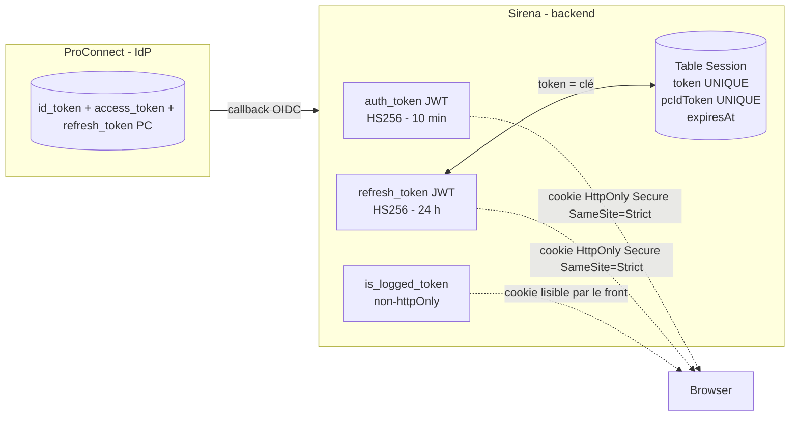
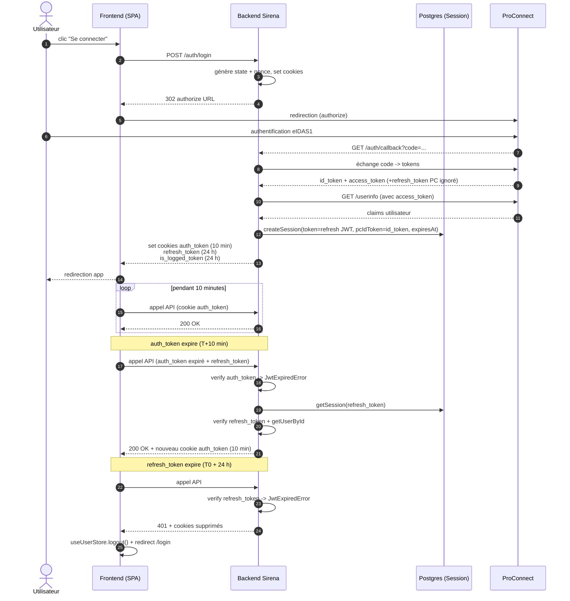
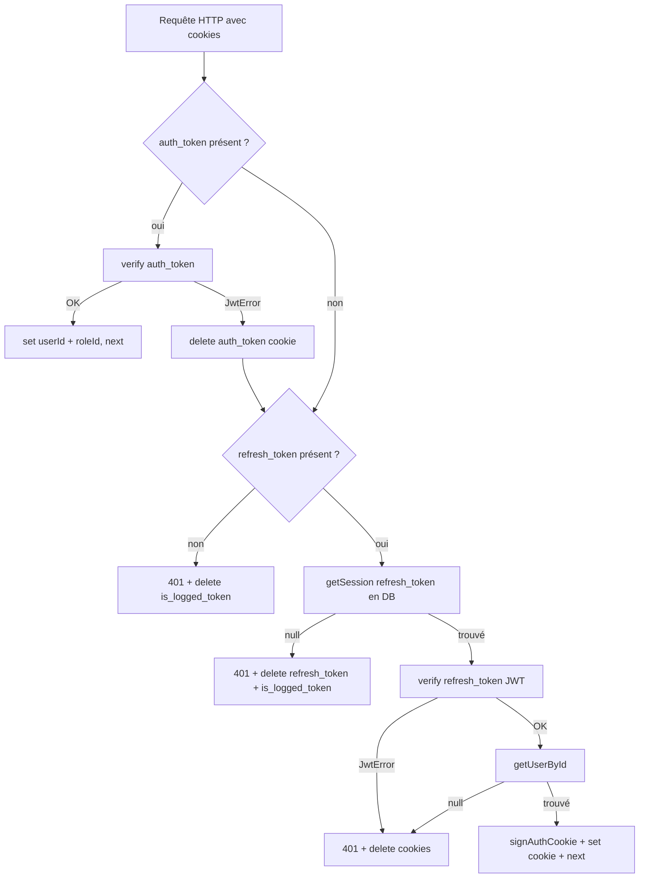
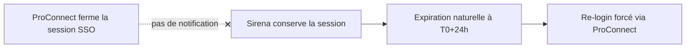

# Durée maximale d'une session Sirena

Ce document décrit ce qui détermine la **durée maximale d'une session utilisateur** dans Sirena : ce que nous contrôlons côté backend, ce qui est délégué à ProConnect, les mécanismes de renouvellement, et les scénarios menant à un échec d'authentification.

> Référence du code : `apps/backend/src/features/auth/`, `apps/backend/src/middlewares/auth.middleware.ts`, `apps/backend/src/middlewares/userStatus.middleware.ts`, `apps/backend/src/features/sessions/sessions.service.ts`, `apps/backend/src/app.ts`, `apps/frontend/src/lib/api/tanstackQuery.ts`, `apps/frontend/src/stores/userStore.ts`, `helm_charts/charts/backend/values.yaml`.
> Versions des libs concernées : `openid-client ^6.8.4`, `jsonwebtoken ^9.0.3`, `hono` (csrf middleware natif).

---

## TL;DR

| Élément | Sous notre contrôle ? | Valeur (prod) | Effet sur la session |
|---|---|---|---|
| `auth_token` (JWT Sirena) | Oui | **600 s (10 min)** | Renouvelé silencieusement à chaque requête tant que le `refresh_token` est valide |
| `refresh_token` (JWT + ligne `Session`) | Oui | **86 400 s (24 h)** | **Plafond dur** de la session : aucune rotation, expiration fixe |
| Session SSO ProConnect | Non | Définie par ProConnect | N'influe pas directement sur la session Sirena tant que le `refresh_token` est valide |
| `id_token` ProConnect (stocké en BDD) | Non | Défini par ProConnect | Utilisé **uniquement** lors du `logout-proconnect` (end-session endpoint) |
| Scope `offline_access` | Non demandé | — | Aucun refresh ProConnect côté Sirena |

**Conclusion** : la durée maximale d'une session Sirena est aujourd'hui fixée par `REFRESH_TOKEN_EXPIRATION` (24 h en prod). Au-delà, l'utilisateur est forcé de repasser par ProConnect.

---

## Architecture des tokens

Sirena délègue l'**authentification** à ProConnect (OIDC), mais gère sa **propre session applicative**. Trois cookies sont émis à la fin du callback OAuth :



| Cookie | Type | Lecture front | Rôle |
|---|---|---|---|
| `auth_token` | JWT `{ id, roleId }` signé `AUTH_TOKEN_SECRET_KEY` | non | Authentifie chaque requête API |
| `refresh_token` | JWT `{ id }` signé `REFRESH_TOKEN_SECRET_KEY` + référencé en BDD via `Session.token` | non | Permet de réémettre `auth_token` sans repasser par PC |
| `is_logged_token` | flag opaque | **oui** | Signal côté SPA pour décider de l'état `isLogged` (cf. `apps/frontend/src/stores/userStore.ts`) |

La table `Session` stocke `{ userId, token, pcIdToken, expiresAt }` avec contraintes UNIQUE sur `token` et `pcIdToken`. C'est elle qui permet la **révocation côté serveur** : tant qu'une ligne existe et que le JWT signe, le refresh est accepté.

> ⚠️ **`Session.expiresAt` n'est jamais vérifié au moment du refresh** (cf. `auth.middleware.ts` ligne 70 : `getSession(refreshToken)` ne lit pas `expiresAt`). L'expiration effective vient **uniquement du claim `exp` du JWT**. La colonne sert aujourd'hui de métadonnée et d'aide aux purges manuelles — pas de garde-fou.
>
> ⚠️ **Aucun job de GC** sur la table `Session` : aucun cron dans `apps/backend/src/crons/` ni `apps/backend/src/jobs/` ne purge les lignes expirées. La table grossit linéairement avec le nombre de logins.

---

## Configuration des durées

`apps/backend/src/features/auth/auth.helper.ts` consomme deux variables d'env :

```ts
const authTokenExpirationDate    = getJwtExpirationDate(envVars.AUTH_TOKEN_EXPIRATION)
const refreshTokenExpirationDate = getJwtExpirationDate(envVars.REFRESH_TOKEN_EXPIRATION)
```

Valeurs effectives :

| Source | `AUTH_TOKEN_EXPIRATION` | `REFRESH_TOKEN_EXPIRATION` |
|---|---|---|
| `.env` / `.env.example` (dev) | `600` (10 min) | `86400` (24 h) |
| `helm_charts/charts/backend/values.yaml` (prod) | `"600"` | `"86400"` |

> **Note** : il n'existe pas aujourd'hui d'override par environnement (validation / production) ; la même valeur est appliquée partout. Les valeurs sont exprimées en **secondes**.

Côté ProConnect, **aucun paramètre de durée n'est configuré dans Sirena** : on délègue intégralement la politique de session SSO à l'IdP (la session PC peut donc être plus courte ou plus longue que 24 h selon la politique fournisseur ; cela n'a aucun effet tant que `refresh_token` Sirena est valide).

Côté JWT, **aucune tolérance d'horloge** n'est configurée (option `clockTolerance` de `jsonwebtoken` non passée → 0 s). Une dérive d'horloge entre pods ou entre client/serveur de plusieurs secondes au moment exact de l'expiration peut produire des `401` transitoires. À surveiller si on observe des déconnexions sporadiques en cluster.

---

## Cycle de vie d'une session



### Ce qui est renouvelé, ce qui ne l'est pas

| Token | Renouvelé en cours de session ? | Comment ? |
|---|---|---|
| `auth_token` | **Oui**, à chaque requête après expiration | `auth.middleware.ts` détecte `JwtExpiredError` et émet un nouveau JWT (`signAuthCookie`) basé sur le `refresh_token` valide |
| `refresh_token` | **Non** | Émis une seule fois au callback, jamais roté |
| `Session.expiresAt` | **Non** | Posée une seule fois à `createSession`, jamais prolongée |

**Conséquence directe** : une session active ne se prolonge pas par activité. Un utilisateur connecté depuis 23 h 50 min n'a plus que 10 minutes avant la déconnexion forcée, quelle que soit son activité.

---

## Logique du middleware d'authentification

`apps/backend/src/middlewares/auth.middleware.ts` :



Points importants :

- L'**absence** du `refresh_token` ou son **invalidité JWT** entraînent une réponse `401`. Le frontend (cf. `apps/frontend/src/lib/api/tanstackQuery.ts`) capte le `401`, déclenche `useUserStore.logout()` et redirige vers `/login`.
- Si le JWT du `refresh_token` est valide mais **qu'aucune ligne `Session` ne correspond** en BDD, la session est considérée révoquée (logout côté serveur, attaque par cookie volé après logout, etc.) → `401`.
- Une erreur **non-JWT** lors de la vérification du `refresh_token` (ex. BDD injoignable) loggue en `error` puis `401`. Aucune tolérance pour les erreurs transitoires DB sur la vérification de session.
- Le rôle est **re-récupéré en BDD à chaque renouvellement** (`getUserById`), donc une rétrogradation/suspension de droits est prise en compte à l'expiration de l'`auth_token` (max 10 minutes de latence).

---

## Scénarios d'échec et de fin de session

### Pendant le login (callback OIDC)

| Cas | Redirection | Code `AUTH_ERROR_CODES` |
|---|---|---|
| ProConnect renvoie un paramètre `error` | `/login?error=PC_ERROR&error_description=...` | `PC_ERROR` |
| Cookie `state` ou `nonce` absent | `/login?error=STATE_NOT_VALID` | `STATE_NOT_VALID` |
| Échange code -> tokens échoue | `/login?error=TOKENS_NOT_VALID` | `TOKENS_NOT_VALID` |
| `id_token` ou `refresh_token` manquant dans la réponse PC | idem | `TOKENS_NOT_VALID` |
| `claims()` retourne `null` | `/login?error=CLAIMS_NOT_VALID` | `CLAIMS_NOT_VALID` |
| `userInfo` indisponible | `/login?error=USER_INFOS_ERROR` | `USER_INFOS_ERROR` |
| Claims requis absents (`email`, `given_name`, `usual_name`, `sub`, `uid`) | `/login?error=CLAIMS_NOT_VALID` | `CLAIMS_NOT_VALID` |
| Création utilisateur : conflit unique (email déjà pris par un autre `sub`) | `/login?error=USER_ALREADY_EXISTS` | `USER_ALREADY_EXISTS` |
| Création utilisateur : autre erreur Prisma | `/login?error=USER_CREATE_ERROR` | `USER_CREATE_ERROR` |
| `createSession` : conflit unique (token ou `pcIdToken` déjà en BDD) | `/login?error=SESSION_ALREADY_EXISTS` | `SESSION_ALREADY_EXISTS` |
| `createSession` : autre erreur | `/login?error=SESSION_CREATE_ERROR` | `SESSION_CREATE_ERROR` |
| Origin du `POST /auth/login` ≠ `FRONTEND_URI` | `403` CSRF natif Hono | — |
| Double-login en moins d'une seconde (JWT refresh identique) | `/login?error=SESSION_ALREADY_EXISTS` | `SESSION_ALREADY_EXISTS` |

> ⚠️ Particularité : si PC ne renvoie pas de `refresh_token`, le callback échoue avec `TOKENS_NOT_VALID`. Or aujourd'hui le scope `offline_access` n'est **pas** demandé (`apps/backend/src/config/openID.ts`). Si ProConnect cessait d'émettre un `refresh_token` par défaut, **tous les logins seraient cassés**. Le `refresh_token` PC n'est par ailleurs jamais utilisé après ce contrôle de présence — c'est un point de fragilité à durcir (vérifier uniquement `id_token`).

### Pendant la session (renouvellement)

| Cas | Conséquence |
|---|---|
| `auth_token` expiré, `refresh_token` valide, session en BDD | Renouvellement transparent (nouveau `auth_token`, 10 min de plus) |
| `auth_token` valide mais l'utilisateur a été supprimé | `Error` levée → fallback sur refresh → si l'utilisateur reste introuvable → `401` |
| `refresh_token` JWT expiré (T0 + 24 h) | `401`, cookies `refresh_token` + `is_logged_token` supprimés, front redirige vers `/login` |
| `refresh_token` JWT valide mais ligne `Session` supprimée (logout serveur, purge, attaque) | `401`, cookies supprimés |
| `refresh_token` JWT signature invalide (rotation de `REFRESH_TOKEN_SECRET_KEY`) | `401`, cookies supprimés — **tous les utilisateurs en cours sont déconnectés** |
| Utilisateur passé `INACTIVE` côté Sirena | `403` avec cause `ACCOUNT_INACTIVE` → front redirige vers `/inactive` (cf. `tanstackQuery.ts`) |
| BDD indisponible au moment d'un refresh | `401` (pas de retry, pas de tolérance) |

### Côté ProConnect

ProConnect peut clôturer sa propre session SSO de son côté à tout moment (politique IdP, déconnexion globale). **Cette déconnexion n'est pas propagée vers Sirena** : aucun webhook back-channel logout n'est implémenté. L'utilisateur reste donc connecté à Sirena jusqu'à expiration du `refresh_token` (≤ 24 h).



### Logout explicite

Deux endpoints :

| Endpoint | Effet |
|---|---|
| `POST /auth/logout` | Supprime cookies + `deleteSession` en BDD, redirige vers `/login`. **N'invalide pas** la session ProConnect. |
| `POST /auth/logout-proconnect` | Supprime cookies + `deleteSession` + redirige vers l'**end_session_endpoint** de ProConnect (avec `id_token_hint = pcIdToken`). Seul moyen propre de couper la session SSO côté IdP. |

---

## Éléments périphériques qui peuvent interférer

Au-delà des deux JWT, plusieurs composants impactent indirectement la disponibilité ou la durée perçue de la session.

### CSRF (`hono/csrf`)

`apps/backend/src/app.ts` enregistre le middleware CSRF **après** le `/third-party` mais **avant `/auth`** et toutes les routes applicatives :

```ts
.use(csrf({ origin: [envVars.FRONTEND_URI] }))
.route('/auth', AuthController)
```

Conséquence : tout `POST /auth/login`, `/auth/logout`, `/auth/logout-proconnect` dont l'en-tête `Origin` ne correspond pas à `FRONTEND_URI` est **rejeté avant** d'atteindre le contrôleur. Si `FRONTEND_URI` n'est pas correctement configuré dans un environnement (typo, schéma manquant, host différent derrière proxy), la session entière devient inaccessible (impossible de se logger ou de se délogger). C'est une cause classique de "ça marche en local mais pas en validation".

### Cookies OAuth temporaires (`state`, `nonce`)

`auth.controller.ts` ligne 42–43 :

```ts
setCookie(c, 'state', state, { path: '/', httpOnly: true });
setCookie(c, 'nonce', nonce, { path: '/', httpOnly: true });
```

Ces deux cookies sont posés **sans `secure`, sans `sameSite`, sans `expires`** :

- Pas de `secure` : pas un problème en prod HTTPS (cookies posés depuis HTTPS), mais permettrait fuite en HTTP si un environnement non-HTTPS existait.
- Pas de `sameSite` : valeur par défaut côté navigateur = `Lax`. Compatible avec le redirect GET de ProConnect vers `/auth/callback` (top-level navigation). À ne **pas** passer en `Strict` sans tester le flow OAuth.
- Pas d'`expires` : cookies de session navigateur. **Fermer le navigateur entre le clic "Se connecter" et le callback purge ces cookies → `STATE_NOT_VALID`**. C'est un échec utilisateur observable mais rare.

### Pas de rate limiting sur `/auth`

Le `rateLimiter` (`apps/backend/src/middlewares/rateLimiter.middleware.ts`) ban une IP après 5 réponses `401` consécutives avec un délai exponentiel. **Il n'est appliqué que sur `/third-party`** (cf. `third-party.controller.ts`). Les routes `/auth/login` et `/auth/callback` n'ont aucune protection volumétrique côté Sirena (la protection brute-force repose entièrement sur ProConnect).

À l'inverse : un utilisateur dont la session expire **n'est jamais banni** par Sirena, même si son SPA spamme des requêtes en boucle après un `401`. Le seul ban actif vise les appels third-party.

### Vérification du statut utilisateur (`userStatusMiddleware`)

`apps/backend/src/middlewares/userStatus.middleware.ts` rejoue un `getUserById` à chaque requête et renvoie `403 ACCOUNT_INACTIVE` si l'utilisateur est `INACTIF` ou `NON_RENSEIGNE` (sauf SUPER_ADMIN). Le frontend (`tanstackQuery.ts`) intercepte ce code et redirige vers `/inactive` — **sans déconnecter** la session.

Ce middleware est **appliqué par route** (pas globalement). Une route protégée par `authMiddleware` mais oubliée du `userStatusMiddleware` laisserait passer un compte inactif. À vérifier en revue lors de l'ajout de nouvelles routes.

### Connexions SSE longue durée

`apps/backend/src/features/sse/sse.controller.ts` expose des flux SSE pour `USER_STATUS` et `REQUETE_UPDATED`. L'auth middleware ne s'exécute **qu'au handshake** ; le stream reste ensuite ouvert. Conséquences :

- Une connexion SSE établie à `T0 + 23 h 55` peut continuer à recevoir des évènements bien après l'expiration du `auth_token`. Pas de re-vérification périodique.
- À la déconnexion (expiration ou logout), la prochaine `EventSource` reconnect (comportement navigateur par défaut) renverra `401`, ce que le SPA captera normalement.

### Multi-sessions et multi-onglets

- **Plusieurs devices/navigateurs** : chaque login PC crée une **nouvelle ligne** `Session` (le `pcIdToken` change à chaque login PC ; le JWT refresh contient un `iat` différent). Aucune limite, aucun éviction du device précédent. Un même utilisateur peut accumuler plusieurs sessions en parallèle.
- **Plusieurs onglets, même navigateur** : tous partagent les mêmes cookies. Les refresh concurrents (deux requêtes parallèles juste après expiration du `auth_token`) déclenchent deux `signAuthCookie` simultanés. Pas de race condition dommageable : le `refresh_token` n'est pas roté, donc les deux flux produisent des `auth_token` valides indépendamment.
- **Double-login en moins d'une seconde** : `jsonwebtoken` met `iat` en **secondes**. Si le même utilisateur déclenche deux callbacks dans la même seconde, les deux JWT refresh sont byte-identiques → la contrainte UNIQUE sur `Session.token` casse → `SESSION_ALREADY_EXISTS`. Scénario rare mais reproductible en test.

### `Session.expiresAt` mort-vivant

Le champ est posé à la création mais **jamais lu** par le middleware d'auth. Trois implications :

1. La révocation effective d'un `refresh_token` passe **uniquement** par `deleteSession` (suppression de la ligne). Une simple mise à jour de `expiresAt` à une date passée ne révoquerait rien.
2. Une rotation du `refresh_token` (si on en implémente une) doit **soit** invalider le JWT précédent au niveau crypto, **soit** intégrer un check `expiresAt > now()` dans `getSession`.
3. La table accumule des lignes "expirées au sens métier mais toujours acceptées au sens code" tant que le JWT n'a pas expiré côté signature.

---

## Ce qui pourrait prolonger la session aujourd'hui

À ce jour, **rien dans le code** ne permet à un utilisateur de dépasser `REFRESH_TOKEN_EXPIRATION` sans repasser par ProConnect. En particulier :

- Pas de rotation du `refresh_token` (le JWT et la ligne `Session.expiresAt` sont posés une seule fois).
- Pas de sliding session : l'`auth_token` peut être renouvelé indéfiniment **dans la limite** du `refresh_token`.
- Pas de prolongation déclenchée par l'activité utilisateur.
- Pas d'utilisation du `refresh_token` ProConnect (le scope `offline_access` n'est pas demandé).

**Leviers possibles** si l'on veut prolonger la durée maximale, par ordre d'impact :

1. **Augmenter `REFRESH_TOKEN_EXPIRATION`** dans `helm_charts/charts/backend/values.yaml`. Solution la plus simple, mais aligne la durée maximale sur la valeur retenue, sans rotation.
2. **Implémenter une rotation du `refresh_token`** dans `auth.middleware.ts` : à chaque refresh, émettre un nouveau JWT, mettre à jour `Session.token` et `Session.expiresAt`. Demande de gérer les race conditions (deux requêtes parallèles) — souvent traité par un grace period sur l'ancien token.
3. **Demander `offline_access`** à ProConnect et déléguer le renouvellement au refresh PC. Aligne la politique de durée sur l'IdP, mais nous fait dépendre de la disponibilité PC à chaque renouvellement.

Chacun de ces leviers a un impact sécurité/sûreté à arbitrer (révocation, vol de cookie, recouvrement après rotation de secret).

---

## Hypothèses de menace et points à surveiller

- **Vol du `refresh_token`** : valide jusqu'au claim `exp` du JWT (24 h). La révocation côté serveur n'est possible que via `deleteSession` (logout) — pas de mécanisme de détection de réutilisation. Une rotation avec famille de tokens (RFC 6819) corrigerait ce point.
- **Rotation de `REFRESH_TOKEN_SECRET_KEY` ou `AUTH_TOKEN_SECRET_KEY`** : déconnecte instantanément tous les utilisateurs (aucun mécanisme de double-signature pour rotation à chaud). À planifier en fenêtre creuse.
- **Compromission de `AUTH_TOKEN_SECRET_KEY`** : permet de forger des `auth_token` valides pour n'importe quel `userId`/`roleId`. La seule limite est la non-existence de la ligne `Session` côté refresh, mais l'`auth_token` seul suffit pour 10 minutes d'accès direct sans toucher la BDD.
- **Suppression d'utilisateur** : prise en compte au plus tard à l'expiration de l'`auth_token` courant (≤ 10 min).
- **Changement de rôle** : idem, ≤ 10 min de latence — le `roleId` est figé dans le JWT `auth_token`, et n'est rechargé en BDD qu'au renouvellement.
- **Statut `INACTIF`** : pris en compte à chaque requête sur une route qui passe par `userStatusMiddleware` (latence ~0). Mais ne déconnecte pas la session — l'utilisateur reste captif sur `/inactive` jusqu'à logout manuel.
- **Accumulation de sessions expirées** en BDD : à terme, prévoir un job de purge (`DELETE FROM "Session" WHERE expiresAt < now() - interval '7 days'`) pour limiter la taille de la table.
- **Logout incomplet** : `POST /auth/logout` casse la session Sirena mais laisse la session SSO ProConnect active → l'utilisateur peut être re-loggué silencieusement au prochain `/auth/login` si la session PC est encore valide. Ce n'est pas un bug, c'est un compromis UX ; mais pour un vrai "Sign out everywhere" il faut utiliser `/auth/logout-proconnect`.

---

## Recommandations

Les pistes ci-dessous sont classées par ratio valeur/effort. Aucune n'est urgente, mais plusieurs sont des quick wins qui simplifieraient la suite (rotation, révocation administrative, durcissement).

### Quick wins (< 1 jour chacune)

#### 1. Rendre `Session.expiresAt` autoritaire côté serveur

Aujourd'hui le champ est mort-vivant (cf. section ci-dessus) : seul le claim `exp` du JWT garde la session. Modifier `sessions.service.ts` pour filtrer explicitement :

```ts
export const getSession = (token: Session['token']): Promise<Session | null> =>
  prisma.session.findFirst({
    where: { token, expiresAt: { gt: new Date() } },
  });
```

Trois gains immédiats :

- **Révocation sans `DELETE`** : `UPDATE Session SET expiresAt = now()` suffit à invalider une session, en gardant la ligne pour l'audit. Ouvre la porte à un futur "déconnecter tous mes appareils" ou à une révocation administrative.
- **Cohérence en cas de rotation de `REFRESH_TOKEN_SECRET_KEY`** : `expiresAt` devient le mécanisme naturel pour distinguer "ancien token dans le grace period" de "token révoqué", utile dès qu'on implémente la rotation.
- **Lève l'ambiguïté pour les devs** : un lecteur du code suppose que `expiresAt` fait foi — aujourd'hui c'est faux, et c'est une source de bugs futurs (PR qui prolonge `expiresAt` en pensant prolonger la session sans toucher au JWT).

À coupler avec un job de purge quotidien :

```ts
// garde 7 jours d'historique pour audit
await prisma.session.deleteMany({
  where: { expiresAt: { lt: subDays(new Date(), 7) } }
});
```

#### 2. Corriger le contrôle `refresh_token` PC dans le callback

`auth.controller.ts` ligne 91 :

```ts
if (!tokens.id_token || !tokens.refresh_token) {
```

Le `refresh_token` PC n'est **jamais utilisé** après (on ne demande pas `offline_access`). Si ProConnect modifie sa politique d'émission, tous les logins cassent sans raison fonctionnelle. Corriger en ne vérifiant que `id_token` (et `access_token` qui sert à `fetchUserInfo`).

#### 3. Ajouter un `jti` dans le JWT refresh

Le `refresh_token` est `jwt.sign({ id }, secret, { expiresIn })`. Avec `iat` en secondes, deux logins du même utilisateur dans la même seconde produisent un JWT byte-identique → conflit UNIQUE sur `Session.token` → `SESSION_ALREADY_EXISTS`. Ajouter un `jti` aléatoire (`crypto.randomUUID()`) dans le payload supprime la collision et améliore la traçabilité.

#### 4. Durcir les cookies `state` et `nonce`

`auth.controller.ts` ligne 42–43 : ajouter `secure: true, sameSite: 'Lax', maxAge: 600`. Garder `Lax` (et pas `Strict`) pour ne pas casser le redirect OAuth, mais borner la durée à 10 min — au-delà, le callback échoue de toute façon, et on évite que ces cookies traînent indéfiniment dans le navigateur.

#### 5. Configurer un `clockTolerance` JWT

`jwt.verify(token, secret, { clockTolerance: 5 })` autorise 5 s de dérive d'horloge. Évite des `401` transitoires lors d'un déploiement avec NTP imparfait.

### Évolutions moyen terme (1-3 jours)

#### 6. Rotation du `refresh_token` avec détection de réutilisation

Le pattern RFC 6819 / OAuth 2.0 Security BCP :

1. À chaque renouvellement de `auth_token`, **émettre aussi un nouveau `refresh_token`** et mettre à jour `Session.token` + `Session.expiresAt`.
2. Garder une trace de l'ancien token pendant un grace period (5–10 s) pour absorber les requêtes parallèles multi-onglets.
3. Si un `refresh_token` déjà utilisé est rejoué après le grace period → **invalider toute la famille de tokens** (logout forcé, signal de vol probable).

Bénéfices : (a) un cookie volé devient inutile dès que la victime fait une requête, (b) on peut sans risque allonger la durée du `refresh_token` à plusieurs jours, (c) la détection de vol devient un signal exploitable côté SOC/Sentry.

Implémentation principalement dans `auth.middleware.ts` (bloc refresh) + ajout d'une colonne `previousToken` ou d'une table `SessionToken` pour le grace period.

#### 7. Rate-limiting sur les routes `/auth`

Étendre l'usage de `rateLimiter` (déjà en place sur `/third-party`) aux routes `/auth/login` et `/auth/callback`, avec un seuil plus permissif (ex. 20 tentatives/15 min). Aujourd'hui la protection brute-force repose entièrement sur ProConnect ; un attaquant qui spamme nos endpoints pour saturer les logs ou tester des `state`/`nonce` n'est pas freiné côté Sirena.

#### 8. Audit de couverture du `userStatusMiddleware`

Lister les routes qui appliquent `authMiddleware` sans `userStatusMiddleware` et décider au cas par cas. Idéalement : chaîner les deux dans un factory unique pour rendre l'oubli structurellement impossible.

### À évaluer (impact produit/sécurité)

#### 9. Back-channel logout ProConnect

Si ProConnect supporte OIDC Back-Channel Logout (RFC 8417), implémenter un endpoint `/auth/back-channel-logout` qui reçoit le `logout_token` et supprime la session correspondante via `pcIdToken` (déjà stocké). Permet une vraie propagation de la déconnexion SSO.

#### 10. Invalider l'`auth_token` au changement de statut sensible

Aujourd'hui, désactiver un compte met jusqu'à 10 min à propager (le `roleId`/`statut` est figé dans le JWT). Pour les actions sensibles (révocation, blocage), `deleteSession(userId)` + côté front un mécanisme de re-fetch profile (ou un check via `userStatusMiddleware` sur toutes les routes critiques) garantit l'effet immédiat.

#### 11. Monitoring dédié à l'auth

Exposer en métriques Prometheus :

- nombre de sessions actives (`SELECT COUNT(*) FROM "Session" WHERE expiresAt > now()`)
- taux de refresh par minute (proxy de l'activité)
- taux de `401` sur `/auth/*` (détection de scan)
- temps moyen entre login et logout (détection de comportement anormal)

Le dashboard Grafana backend (`docs/grafana_dashboards/Backend monitoring*.json`) peut être étendu sans nouveau code côté backend si Prisma expose déjà les compteurs nécessaires.
